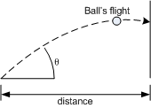
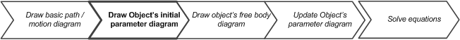
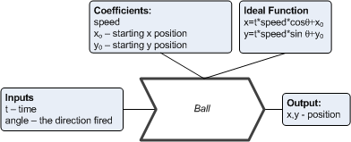
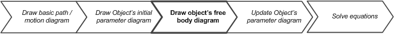
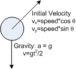
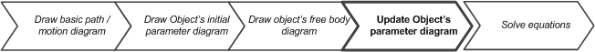
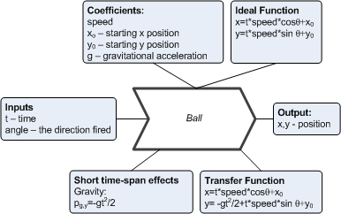

Ball into Hoop
====================

This is a program to practice shooting a ball into a hoop on the wall

Demo
------

(click to see video)

The Task
--------

The problem is to figure out the angle to shoot a ball to get it into a hoop on the wall.

The exercise is to write a procedure **targetBallShooter()** that returns angle to shoot a ball.
The procedure is given the x distance ball shooter to the hoop, ball's speed (once shot), the height of the hoop,
and the acceleration due to gravity.  The procedure should computer the angle to shoot the ball, and return
the value.

The procedure has access to the global state of the game, but it is not allowed to change any.  These
state variables are:

* *ballShooter_x0*  is the distance to the wall that has the hoop; this is the x distance to the hoop.
* *hoop_y*  is the height of the hoop above the floor; this is the y distance to the hoop.
* *ballShooter_speed*   is the speed with which a ball is shot.
* *gravity*     is the gravitational acceleration on the ball.

### Steps to solve the challenge

In this section I'm going to give a walk-thru in the steps of solving the problem (and generally how to set
of the software to meet challenges in games like this.)

This walk-thru is targeted to an advanced middle school level.  This problem doesn't rely heavily on deriving the
equations -- but you're expected to work out  how to get them into the computer program appropriately.  At an advanced
high-school level, the student should derive the equations.

I will use diagrams; it's tempting to dismiss them, as they are "just" pictures.  Do not.  They help break the problem
down, make it easily solvable (or at least, easier to solve), organize the information you need, and help reduce mistakes.

#### Step 1: Diagram the situation

The first step is diagram the basic event that is happening: the who's, the when's, and the where's.
The objective is to shoot a ball to the hoop on the wall.  So the "who's" are a ball and a hoop.
The "where" is the place they hit each other.  And the "when" is the point in time the hit each other:

#### Step 2: Describe each of the objects

The next step is to describe the ball and it's flight parameters in a "parameter diagram":

This describes the balls straight-line flight at angle from the point it was shot.  (We'll add gravity in next)
The input to modelling the ball is it's time in the flight, and the result is the location after it's flown.

#### Step 3: Draw free body diagrams for the objects

Now that we've described the basic ball, the next step is describe the forces on the ball, using a "free-body diagram":

This diagram is used to help work out all of the forces acting on the ball.  The first step is to draw the actions by
the ball, and then fill in with the forces that act on the ball.  (In later projects we'll see how some of the forces
on the ball are done in response to the action by the ball).  The new forces will be added to the parameter diagram in
the next step.

#### Step 4: Update the object's parameter diagrams

Once the free-body diagram has been fleshed-out, the next step is to update the parameter diagram with the added
forces and how they affect the ball's behaviour:

The gravity force was added to the diagram in a lower box (for things that act on an object all the time, or very quickly).
A second box was added to capture what the gravity does to the ideal motion of the ball, and changes that into 
a model of an "actual" motion.  As this is targeted toward (advanced) middle school students, the formulation for
motion is given.  (Advanced) high school students should derive the formula.

#### Step 5: Solve the equations, and implement it in code

The next step is to solve the equation.  For the (advanced) middle school student, I will walk thru the steps to this
using the C-language.  There are many other ways of solving this.  The (advanced) high school student should work thru
the equations and solve them in a closed-form; that is, should come up with equations that do not use iteration.

Here is a brute force technique to finding a suitable angle.  Use a 'for' loop with an angle variable going from 0 degrees to 90 degrees.  Use steps of 1 degree.   The body of the for loop is:

1. Calculate the time that the ball will hit the wall.  This is the time when the x formula is 0.  (You will have to convert the formula to be a function of the angle, to compute the time t.)
2. Using the time and angle, calculate the height above ground the ball will be (when it hits the wall).
3. Calculate how close this height is with the height of the hoop (*hoop_y*)
3. Is this closer than the other attempts?  If so, save the angle and height.

When done iterating, return the best angle.

I'm not going to give explicit steps how to make this algebra, nor am I going to give explicit steps on how to code it.
That's _your_ job.

Requirements
---------------
The was created using the Xcode editor running under Mac OS X 10.8.x or later. 

